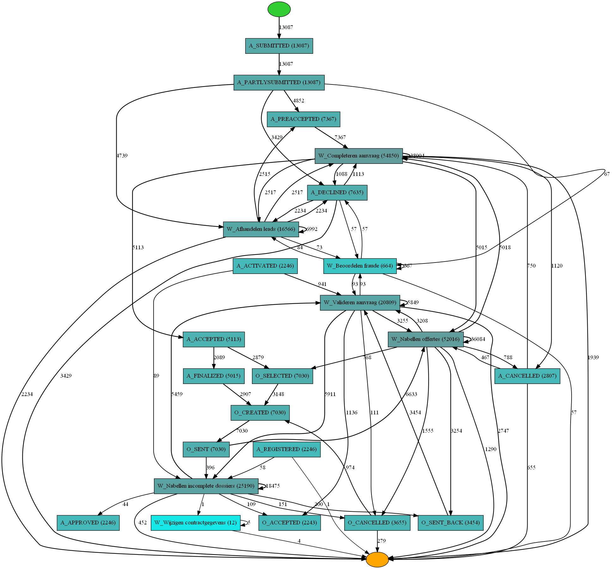

# Introduction to Process Mining using Python (PM4PY)

# Summary

Process mining is a family of techniques in the field of process management that support the analysis of business processes based on event logs. During process mining analysis, a specialized data mining algorithms are applied to the event logs (after transform it) in order to identify trends, patterns and extract insights. Process mining aims to improve process efficiency and the understanding of the processes themselves which in turn help in making better business decisions.
It captures the digital footprints from any number of systems throughout an organization and organizes them in a way that shows each step of the journey to complete that process, along with any deviations from the expected path.

Good luck and feel free to get in touch if you have any question or comments.

**Structure of the document:** 

The notebooks folder contains the full jupyter notebook. The data folder (raw data) contains the publicly available datasets that is used in this analysis.

*Note: when running the notebook, make sure to change the path to the file.*

# Examples of Algorithms used

## Alpha Minner algorithm

## Heuristic Minner

# Conclusion & Recommendations

For more information regarding the above examples of algorithms please see the notebook comments.

**Next Step**
- Perform segregation of duty analysis
- Anomoly detection to isolate out of pattern process
- Visualize communications between resources through Network analysis using NetworkX

# References

- [Link to PM4PY documentation](https://pm4py.fit.fraunhofer.de)
